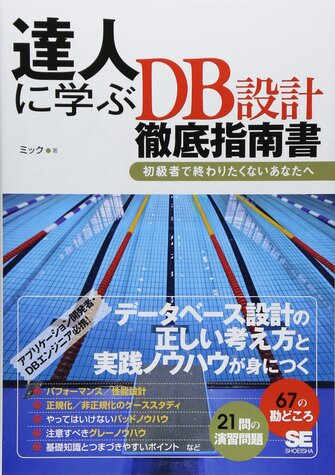
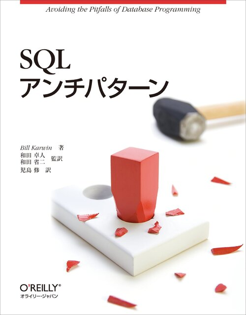

# データベース[1/5] イントロダクション

---

# 自己紹介

↑ slackアイコン

* 名前：阿部翔太
* 大学：東京工業大学 数理計算科学系B3(東京工業大学デジタル創作同好会(trap))
* 東進歴
  * 2020年8月: 物理科添削者
  * 2020年10月: 物理科リーダー
  * 2021年4月: ITチーム
* 開発経験
  * よく使う言語: python(2年半), go(1年半)
  * その他: Scala, JS(TS), Java, C++, terraform etc

---

# 今回やること

1. イントロダクション[今回]
   * データベースとは何か
   * なぜデータベースが必要か
   * RDBの基礎
   * 2～5回のTOPICの紹介
2. RDBの設計
3. SQLアンチパターン
4. パフォーマンスチューニング
5. NoSQL入門

---

# データベースとは

* 検索や蓄積が効率よくできるよう、整理・構造化された情報の集まり
* データベースを管理するコンピュータシステムのことを、「データベース管理システム（略してDBMS）」と呼ぶ。
* 広義には電子化されたものも以外も含まれるため、電話帳や辞書などもデータベースと言える

---

# 身近にあるデータベース

* 銀行の講座データベース
* 図書館の文献データベース
* スーパーマーケットの商品データベース
* etc
* **各種サービスのwebの裏にはデーベースがほぼ必ず存在する**

---

# Webとデータベース

---

# データベースの種類 

* データベースの種類
  * リレーショナルデータベース(RDB)
    * 有名なRDBMS: MySQL, PostgreSQL, MariaDB
  * 階層型データベース
    * データを階層構造（木構造）で表現
  * ネットワーク型データベース
  * キーバリューストア型
  * ドキュメント指向型
  * etc
* RDBMS以外をNoSQLという

---

# なぜデータベースが必要か

* 従来のファイルシステムの問題点
  * 多人数でデータを共有するのに向かない
    * 複数人での編集が難しい
  * 物理構造・配置を意識する必要がある
    * データアクセス時にファイルの場所、何バイト目かなどの情報が必要
  * 万一の事故に対応できない
    * ファイル操作を誤って削除してしまったり、ハードディスクが故障して読み出せなくなることにより、データ紛失の恐れがある
* DBMSは上記の問題点を解決可能

---

# DBMSの機能

* データの操作
  * RDBMSでは基本的にSQLを用いる
* データを論理的に構造化する
  * 物理的な位置に依存しない(↔ファイルシステム)
* データ完全性
  * 不正なデータ登録・更新を防ぐ
* トランザクションの管理(RDBMS)
  * 複数のデータ操作が着実に行われるように管理
  * 故障や異常が発生しても大丈夫なように管理

---

# RDBの構造

|ユーザーID(PK)|ユーザー名|出身地|
|--|--|--|
| 1 | 太郎 |東京|
| 2 | 次郎 |大阪|

* カラム(列): 一つのデータが持っている情報の種類
  * 上のテーブルでいうユーザーIDやユーザー名
* レコード(行): 一つのデータと対応する
  * 上のテーブルでいう(1, 太郎, 東京), (2, 次郎, 大阪)
* 主キー(PK): DBのレコードを一意に識別するためのカラム
  * RDBでは必ず必要

---

# SQL: RDBの操作のための言語

* RDBではSQLと呼ばれる言語を使って、データの登録・検索・更新・削除が可能
* テーブル自体の定義もSQLを使って行うことができる
* 例: `SELECT name FROM users WHERE id=100;`
  * usersテーブルからidが100のもののユーザー名を取得するSQLクエリ

---

# まとめ

* データベースとは検索や蓄積が効率よくできるよう、整理・構造化された情報の集まり
* webサービスの裏ではほぼ確実にDBが利用されれている
* DBMSは従来のファイルシステムの問題点を解決する
* RDBMSではSQLを用いてデータの操作を行う

---

# 次回以降のTOPIC紹介

---

# RDBの設計

* RDBの設計
  * 理論的には関係モデル(集合論と述語論理に基づいて考案されたモデル)に基づく
* 「論理設計」と「物理設計」の二種類がある
* 論理設計
  * 重要キーワード: 正規化
* 物理設計
  * データ型の定義, index定義 etc
  * データの物理的配置等も含むが、ここはRDBMSが上手いことやってくれる

---

# RDBの設計 参考図書

---

# SQLアンチパターン

* DB設計・SQLにはアンチパターンと言われる多くの失敗事例がある
* アンチパターンを知ることで、より安全で堅牢なDB設計・正しく効率的なSQLクエリの発行ができるようになる

---

# SQLアンチパターン

* 論理設計のアンチパターン
  * ジェイウォーク
  * キーレスエントリ etc
* 物理設計のアンチパターン
  * ラウンディングエラー etc
* クエリのアンチパターン
  * フィア・オブ・ジ・アンノウン
  * アンビギュアスグループ etc
* アプリケーションのアンチパターン
  * リーダブルパスワード
  * SQLインジェクション etc

---

# SQLアンチパターン 参考図書

---

# パフォーマンスチューニング

* データベースに保存されるデータは日に日に増大していく
  * 一億を超えるデータもざらにある
* 適切な設計・実装をするかどうかでレイテンシ(レスポンスが返って来るまでの時間)に100倍以上の差が出ることもある
* 高速なwebアプリケーションを作ることはユーザー体験(UX)の向上のためにも非常に大事
* キーワード
  * インデックス
  * N+1問題

---

# パフォーマンスチューニング 参考図書

---

# NoSQL入門

* NoSQLはRDBMS以外のDBMSの総称
* NoSQLにはRDBMSに備わっている「結合(join)」や「トランザクション」といった機能がないことが多い
  * そのためNoSQLは厳密な一貫性は担保しない(結果整合性を担保する)
* 一方で、特定のユースケースにおいてはRDBを大きく上回るパフォーマンスを発揮することがある
* 様々な種類のものがあるが主に以下の二つを扱う予定
  * キーバリューストア型(KVS)
    * reids, dynamoDB
  * ドキュメント型
    * MongoDB

---

# 次回：データベース[2/5] RDBの設計
